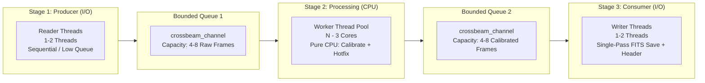
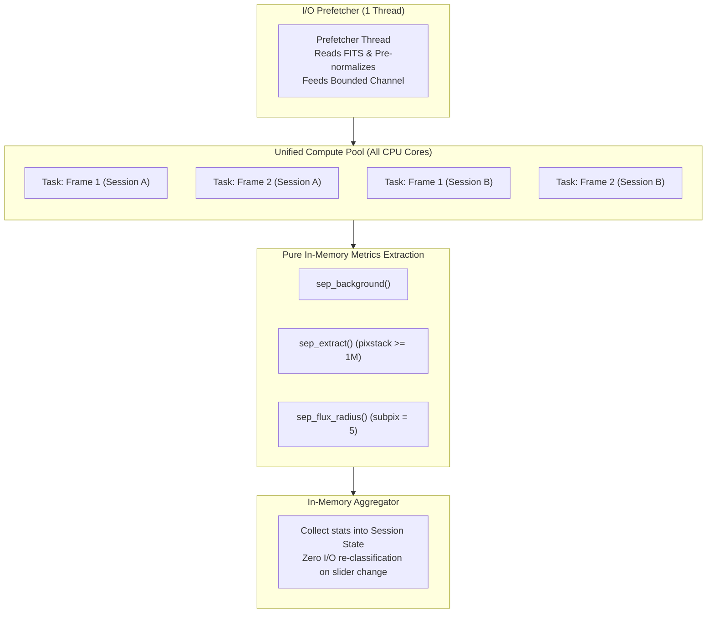
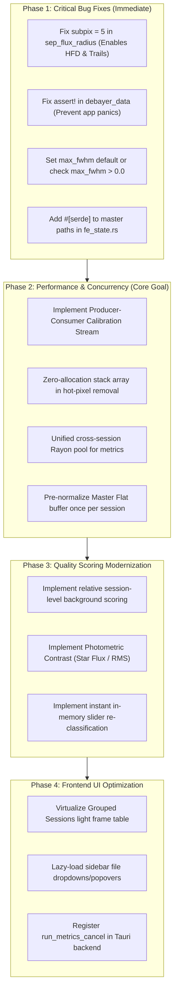

# Comprehensive Project Analysis & Optimization Report: AstroGrader
**Project:** AstroGrader (Semestral Project $\to$ Master's Thesis)  
**Date:** September 15, 2026  
**Repository:** `patrick11514/MasterThesis`  
**Location:** `/home/patrick115/Projects/MasterThesis`

---

## 1. Executive Summary

AstroGrader is an astrophotography grading and calibration application built with a **Rust/Tauri** backend and a **SvelteKit/WebGL** frontend. Its primary objective is to automate the grading, quality scoring, rejection, and calibration of astronomical FITS frames across multi-night observing sessions.

During our in-depth architectural and algorithmic audit, we identified the fundamental root causes behind the three main concerns:
1. **Background contrast scoring failure:** The metric $\frac{\text{Background}}{\text{RMS}}$ is mathematically and physically flawed for astrophotography quality assessment. It computes the signal-to-noise ratio of the sky pedestal rather than contrast, penalizes high-signal and extended nebulae frames, fails completely on raw uncalibrated frames due to sensor bias pedestals, and hardcodes arbitrary thresholds ($10.0$ / $15.0$) that reject good data.
2. **Calibration concurrency bottlenecks:** Calibration uses a lock-step chunking pattern (`chunks(num_threads).par_iter()`) that entangles heavy disk I/O with CPU computation, thrashes storage devices, and wastes thread cycles. Additionally, hot-pixel removal causes up to **24–60 million heap allocations per frame**, and flat-field normalization is redundantly recomputed across millions of pixels for every single light frame.
3. **Metrics thread starvation & sub-optimal utilization:** The metrics pipeline processes sessions sequentially in isolated chunks, starving CPU cores on smaller sessions, stalling workers on synchronous disk I/O, and suffering from a critical latent bug: **`subpix = 0` passed to `sep_flux_radius`**, which causes Half-Flux Diameter (HFD) calculation to fail on 100% of detected stars.

Beyond these three primary concerns, we uncovered several severe bugs, including panicking assertions on monochrome frames, missing master frame persistence in `.agproj` project files, absent backend IPC cancel handlers, default configuration traps (`max_fwhm = 0.0`), and severe frontend DOM bloat.

This report provides an exhaustive diagnosis of every issue, theoretical explanations, and concrete implementation blueprints for the transition to the Master's Thesis.

---

## 2. Deep Dive: Background Contrast Scoring

### 2.1 Current Implementation & Code Flow
In `astro-grader/src-tauri/src/processing/metrics.rs`:
```rust
let background = SepBackground(background_ptr);
let global_background = unsafe { sep_bkg_global(background.0) };
let global_background_rms = unsafe { sep_bkg_globalrms(background.0) };

let background_contrast = if global_background_rms.abs() > f32::EPSILON {
    Some(global_background / global_background_rms)
} else {
    Some(global_background)
};
```
In `astro-grader/src-tauri/src/processing/scoring.rs`:
```rust
const W_BG: f32 = 1.5;
const BG_MAX: f32 = 10.0;

pub fn norm_bg(bg: Option<f32>) -> f32 {
    clamp01(bg.unwrap_or(0.0) / BG_MAX)
}

// Inside compute_score:
score -= W_BG * s_bg;
```
In `astro-grader/src-tauri/src/processing/metrics.rs` (`classify_frame`):
```rust
if bg_contrast > 15.0 {
    return (
        FrameState::Rejected,
        Some("Severe Background Glow".to_string()),
    );
}
```

### 2.2 Why Background Contrast Scoring "Works Bad"

#### A. Mathematical & Physical Fallacy of $\frac{\mu_{\text{bg}}}{\sigma_{\text{bg}}}$
1. **It measures sky pedestal SNR, NOT contrast:**
   In astronomical imaging, the sky background photon arrival follows a Poisson distribution where variance equals mean: $\sigma_{\text{photon}}^2 = \mu_{\text{sky}}$. Therefore:
   $$\frac{\mu_{\text{bg}}}{\sigma_{\text{bg}}} \approx \frac{\mu_{\text{sky}}}{\sqrt{\mu_{\text{sky}}}} = \sqrt{\mu_{\text{sky}}}$$
   The ratio is inherently proportional to the **square root of the background brightness**. Any increase in exposure time (e.g., 60s $\to$ 180s), faster optical focal ratio (e.g., f/2 vs f/7), or broader filter passband (Luminance vs Narrowband H$\alpha$) naturally drives this ratio up.
2. **Hardcoded Thresholds ($10.0$ / $15.0$) Are Meaningless Across Datasets:**
   - On a clean 180s H$\alpha$ frame (`test_fits/2025-07-03...`): `background_contrast = 15.42`. Because $15.42 > 15.0$, it is **hard-rejected** as `"Severe Background Glow"`.
   - On a stacked Orion frame (`test_fits/MASTER_LIGHT_PANEL3_ORION.fits`): `background_contrast = 67.28`. **Hard-rejected** as `"Severe Background Glow"`.
   - In `scoring.rs`, `BG_MAX = 10.0`. Since almost all good frames exceed 10.0, `norm_bg()` clamps to `1.0`. The penalty `W_BG * 1.0 = 1.5` is subtracted directly from the score, plunging quality scores into negative territory (e.g., `-1.836` for crisp frames with 500+ round stars).
3. **Camera Bias Pedestals on Uncalibrated Frames:**
   Raw astronomical CMOS/CCD sensors introduce a hardware bias offset (typically 100 to 1,000 ADU, e.g., 500 ADU on ZWO ASI cameras) to prevent zero-clipping from readout noise. If metrics are run on uncalibrated frames, $\mu_{\text{bg}}$ includes this massive artificial offset while $\sigma_{\text{bg}}$ remains tiny ($\approx 10\text{--}20$ ADU). The ratio blows up to $50\text{--}100+$, immediately rejecting every single raw light frame.
4. **Dark Subtraction Over-Subtraction & Zero-Clipping:**
   When `calibrate_light` subtracts a dark frame, any pixel below zero is clamped: `if calibrated < 0.0 { calibrated = 0.0; }`.
   If a dark frame slightly over-subtracts the sky background, large regions become exact zeroes (`0.000000`). When SEP estimates the background on an over-subtracted image, $\mu_{\text{bg}} \approx 0$ and $\sigma_{\text{bg}} \approx 0$, producing a `background_contrast` near $0.0$. The current scoring logic rewards this as a "flawless" background, even though the astronomical signal was severely damaged by clipping.
5. **Extended Nebulosity Corrupts Background Tiling:**
   SEP estimates background using a grid of $64 \times 64$ tiles with $3 \times 3$ median filtering. For large targets (e.g., Orion M42, Rosette Nebula, Andromeda M31), the nebulosity covers significant portions of the field. The nebula's emission is erroneously interpreted as "background sky", inflating $\mu_{\text{bg}}$ and falsely triggering rejections.

### 2.3 Correct Astronomical Scoring Architecture

Astronomical subframe selectors (e.g., PixInsight SubframeSelector, ASTAP, NINA) evaluate sky and background using relative and physically grounded metrics:

1. **Relative Session Baseline (Outlier Detection):**
   Sky brightness must be evaluated **relatively within the same observing session and filter**:
   - Compute the median background $\widetilde{B}$ and MAD $\sigma_B$ across all frames of that session.
   - A frame is flagged for clouds or light dome intrusions only if its background deviates significantly from the session median:
     $$z_{\text{bg}} = \frac{B_i - \widetilde{B}}{\sigma_B} > +3.0$$
2. **Cloud Detection via Star-Background Anti-Correlation:**
   Clouds passing over an observatory produce a distinct physical signature:
   - In light-polluted/suburban skies: Background brightness spikes ($B_i \uparrow$) due to scattered city light, while detected star flux and star count drop ($N_{\text{stars}} \downarrow, F_{\text{stars}} \downarrow$).
   - In dark skies: Background remains dark, but star count drops drastically ($N_{\text{stars}} \downarrow$) and FWHM inflates.
   A joint metric $Q_{\text{cloud}} = \frac{\Delta B / \widetilde{B}}{\Delta N_{\text{stars}} / \widetilde{N}_{\text{stars}}}$ cleanly isolates clouds without relying on absolute cutoffs.
3. **True Frame Contrast / Star SNR:**
   Instead of $\mu_{\text{bg}} / \sigma_{\text{bg}}$, measure the **Photometric Contrast** (Star Signal to Background Noise):
   $$\text{Frame SNR} = \frac{\text{Median Star Flux}}{\sigma_{\text{background}}}$$
   This measures how well astronomical signals stand out above the noise floor. Higher is better.

---

## 3. Deep Dive: Streaming Calibration Pipeline (Producer-Consumer Pattern)

### 3.1 Current Architecture & Bottlenecks

In `astro-grader/src-tauri/src/processing/calibrate.rs`:
```rust
let num_threads = rayon::current_num_threads();
for (chunk_idx, chunk) in light_files.chunks(num_threads).enumerate() {
    let chunk_result = chunk.par_iter().map(|light_file| {
        // Step 1: Open FITS from disk (I/O)
        // Step 2: Read pixels into Vec<f32> (I/O + Memory)
        // Step 3: Calibrate pixels (nested par_iter_mut CPU)
        // Step 4: Remove hot pixels (nested par_chunks_mut CPU)
        // Step 5: Save image to .tmp FITS (I/O)
        // Step 6: Atomic rename .tmp to destination (I/O)
        // Step 7: Open file again with FitsFile::edit to write headers (I/O)
    }).collect();
}
```

#### Major Deficiencies:
1. **Lock-Step Chunking Barrier:** If 16 threads process a chunk of 16 files, 15 threads that finish early must sit completely idle waiting for the single slowest file to complete before the next chunk can start.
2. **I/O and Compute Contention:** When a chunk starts, all 16 threads hit the disk simultaneously to read 30–100MB files. Mechanical HDDs experience extreme head thrashing, and SSD controller queues saturate. Later, all 16 threads hit the disk simultaneously to write.
3. **Nested Rayon Thread Pool Contention:**
   `chunk.par_iter()` spawns Rayon tasks. Inside each task, `calibrate_light` calls `light.par_iter_mut()` and `remove_hot_pixels` calls `target_plane.par_chunks_mut()`. Nesting parallel iterations inside parallel tasks introduces massive work-stealing scheduling overhead and cache ping-ponging.
4. **Catastrophic Memory Allocation in Hot Pixel Removal:**
   In `replace_hot_pixels_in_plane`:
   ```rust
   fn neighborhood_hot_pixel_threshold(neighbors: &[f32]) -> f32 {
       let mut sorted = neighbors.to_vec(); // HEAP ALLOCATION PER PIXEL!
       ...
   }
   ```
   For every pixel in a 24–60 megapixel image, a `Vec<f32>` is allocated on the heap, sorted, and deallocated. That is **24,000,000 to 60,000,000 heap allocations per light frame**! This causes extreme global allocator contention across threads and stalls CPU caches.
5. **Redundant Flat-Field Normalization:**
   Inside `calibrate_light`, `flat_mean` is computed by parallel-reducing all flat pixels on *every single light frame*:
   ```rust
   let flat_sum: f32 = flat_data.par_iter().enumerate().map(...).sum();
   ```
   If a session has 500 light frames, the exact same 30-million-pixel flat frame is summed 500 times.
6. **Double Disk Reads in Master Stacking:**
   In `produce_master`, frames are read sequentially once to check dimensions, and then all frames are read from disk *again* to compute the stack.

### 3.2 Proposed Streaming Producer-Consumer Architecture



#### Key Design Principles:
1. **Thread Partitioning:**
   - **Reader / Loader (1–2 threads):** Reads raw FITS files sequentially from disk into pre-allocated memory buffers. Sequential disk reads maximize sequential read bandwidth (especially on HDDs and external USB drives) and eliminate random seek latency.
   - **Processing Workers ($N - 3$ threads):** Dedicated CPU pool pulling from Queue 1. Operates purely in-memory.
   - **Writer / Saver (1–2 threads):** Consumes calibrated buffers from Queue 2 and writes the final FITS file and headers in a single pass.
2. **Backpressure via Bounded Channels:**
   Using bounded channels (capacity 4–8 items) guarantees that memory consumption is strictly capped. At 50MB per frame, 8 frames in flight consume $\approx 400\text{ MB}$ of RAM, completely eliminating Out-Of-Memory risks.
3. **Stack-Allocated Hot-Pixel Filtering:**
   Replace the heap allocation in `neighborhood_hot_pixel_threshold` with a stack-allocated fixed array:
   ```rust
   #[inline(always)]
   fn neighborhood_hot_pixel_threshold_fast(mut neighbors: [f32; 8]) -> f32 {
       neighbors.sort_unstable_by(|a, b| a.partial_cmp(b).unwrap_or(std::cmp::Ordering::Equal));
       let median = neighbors[4];
       let mut mad_sum = 0.0f32;
       for &val in &neighbors {
           mad_sum += (val - median).abs();
       }
       let mad = mad_sum * 0.125;
       median + HOT_PIXEL_SIGMA_FACTOR * mad.max(1e-12) + HOT_PIXEL_ABS_FLOOR
   }
   ```
   *Performance impact:* Eliminates 24–60 million heap allocations per frame. Hot-pixel removal speedup: $\approx 15\times\text{--}25\times$.
4. **Pre-Normalized Master Flats:**
   Compute `flat_mean` and pre-normalize the master flat buffer **once** when loading the master frame for the session, removing the redundant full-frame reduction from the per-light loop.
5. **Single-Pass FITS Writing:**
   Write the image pixels and copy source metadata headers in a single open/write cycle, eliminating the secondary `FitsFile::edit()` disk re-open.

---

## 4. Deep Dive: 100% Thread Utilization on Metrics

### 4.1 Root Causes of Idle Threads & Stalls

1. **Session-Level Barrier & Imbalance:**
   `run_metrics` iterates over sessions sequentially:
   ```rust
   for (session_index, session) in state.grouped_nights.iter_mut().enumerate() {
       let outcomes: Vec<_> = session.lights.par_iter().map(...).collect();
   }
   ```
   If a user has 5 sessions (e.g., 6 frames in Ha, 8 in OIII, 12 in SII), on a 16-core or 32-core machine, **more than 50–75% of CPU cores remain completely idle** throughout the run. Rayon waits for the session barrier to synchronize before starting the next session.
2. **Worker Stalls on Synchronous Disk I/O:**
   Inside `session.lights.par_iter().map()`, each worker thread performs synchronous FITS file opening and pixel reading:
   ```rust
   let mut fits = FitsFile::new(image_path.clone())?;
   let image = ImageDataPixels::from_fits(&mut fits)?;
   ```
   Rayon worker threads are CPU worker threads. When they block on disk I/O, OS context switches occur, CPU core utilization drops, and Rayon cannot schedule compute work efficiently.
3. **SEP Internal Pixel Buffer Overflow:**
   As discovered in `output.txt`:
   ```
   SEP extraction failed: internal pixel buffer full: The limit of 300000 active object pixels over the detection threshold was reached.
   ```
   When a frame has high noise, an uncalibrated pedestal, or dense star fields (Milky Way, star clusters), active pixels exceed SEP's default buffer of 300,000, causing metrics extraction to crash and reject the frame. `sep_set_extract_pixstack(1_000_000)` is never called.
4. **CRITICAL LATENT BUG: `subpix = 0` Breaks HFD Completely:**
   In `metrics.rs` lines 296–311:
   ```rust
   let radius_status = unsafe {
       sep_flux_radius(
           &detection_image,
           x, y,
           (major as f64 * 4.0).max(4.0),
           0,
           0, // <--- SUBPIX IS PASSED AS 0!
           0,
           ptr::null(),
           flux_fraction.as_ptr(),
           1,
           flux_radius.as_mut_ptr(),
           &mut radius_flag,
       )
   };
   ```
   In SEP's C implementation (`aperture.c` line 377):
   ```c
   if (subpix < 1) {
       return ILLEGAL_SUBPIX;
   }
   ```
   Because `subpix` was set to `0`, **`sep_flux_radius` returns an error code on EVERY SINGLE STAR in EVERY SINGLE IMAGE**.
   Consequently, line 316:
   ```rust
   let hfd = if radius_status == 0 && flux_radius[0].is_finite() && flux_radius[0] > 0.0 {
       (2.0 * flux_radius[0]) as f32
   } else {
       fwhm // ALWAYS FALLS BACK TO FWHM!
   };
   ```
   `hfd` was **always identical to `fwhm`**. In `scoring.rs`:
   ```rust
   if fwhm > 0.0 && hfd / fwhm > HFD_FWHM_RATIO_THRESHOLD { trail = trail.max(1.0); }
   ```
   Because `hfd == fwhm`, `hfd / fwhm` is always `1.0`, meaning trail detection via HFD/FWHM ratio **has never worked**.

### 4.2 Solution to Keep Threads 100% Busy



1. **Flatten Work Across All Sessions:**
   Create a single flat work list of all light frames across all sessions:
   `let all_work: Vec<(SessionId, usize, PathBuf)> = ...;`
   Feed all frames into the Rayon pool simultaneously. No worker core ever sits idle while another session has work.
2. **Decouple I/O with a Prefetch Channel:**
   A dedicated background thread pre-loads FITS pixel arrays into a bounded channel (capacity 4–6). Workers pull loaded images directly from memory and run SEP without waiting on disk I/O.
3. **Fix `subpix` Parameter:**
   Pass `subpix = 5` (standard SEP subpixel sampling) so `sep_flux_radius` succeeds, enabling real HFD measurement and star-trail ratio detection.
4. **Expand SEP Pixel Stack:**
   Call `unsafe { sep_set_extract_pixstack(1_000_000); }` to prevent buffer overflows on dense star fields.
5. **Instant In-Memory Reclassification:**
   When the user changes the rejection threshold or max FWHM slider in settings, do **not** re-run FITS loading and SEP extraction (`appState.runMetrics()`). Reclassify instantly using the cached `file.stats` already in memory (duration: $< 1\text{ ms}$ instead of minutes).

---

## 5. Audit: Additional Issues, Bugs & Performance Flaws

### 5.1 FITS Processing & Image Algorithms

| # | Issue | File Location | Impact | Severity |
|---|---|---|---|---|
| **1** | **Master flat normalization missing in code** | `calibrate.rs:475-600` | Code does not normalize master flats to unity gain (contrary to documentation and thesis). | **Medium** |
| **2** | **Bayer pattern panic on Monochrome images** | `utils.rs:20-24` | `assert!(bayer_pattern.contains('R'))` panics and crashes the app if debayering is triggered on mono FITS or invalid string. | **High** |
| **3** | **`fwhm > max_fwhm` with default 0.0** | `metrics.rs:130` & `config/mod.rs:68` | Config defaults `max_fwhm = 0.0`. `fwhm > 0.0` is true for all stars, causing all frames to be rejected unless manually reconfigured. | **High** |
| **4** | **Star extraction directly on raw Bayer mosaic** | `metrics.rs:511` | SEP runs star extraction directly on un-debayered Bayer check pattern, distorting FWHM and eccentricity calculations. | **Medium** |
| **5** | **`normalize_pixels_if_needed` threshold heuristic** | `calibrate.rs:135` | Dividing by `65535.0` whenever `max > 1.5` misclassifies non-16-bit FITS (e.g., 32-bit float or integer). | **Medium** |
| **6** | **Telescope tag parsing `FOCALLEN`** | `tag.rs:28` | Parses focal length number (e.g. `500.0`) as telescope name if `TELESCOP` header is absent. | **Low** |

### 5.2 State Management, IPC & Architecture

| # | Issue | File Location | Impact | Severity |
|---|---|---|---|---|
| **7** | **Master paths dropped on project save/load** | `fe_state.rs:46-52` | `master_dark`, `master_flat`, `master_bias` are marked `#[serde(skip)]`. Reloading an `.agproj` loses all master associations. | **High** |
| **8** | **Missing backend `run_metrics_cancel`** | `state.svelte.ts:436` vs `processing/mod.rs` | Frontend calls `invoke('run_metrics_cancel')`, but Rust command does not exist. Metrics cannot be cancelled once started. | **Medium** |
| **9** | **Synchronous single-threaded directory scanning** | `file_picker/mod.rs:121` | `file_picker_recursive` opens and parses FITS headers one by one on a single thread. Slow on 4,000+ files. | **Medium** |
| **10** | **RAM accumulation in preview cache** | `rust_state.rs:13` | Caches full uncompressed float and byte vectors (`500+ MB`) indefinitely in memory. | **Low** |

### 5.3 Frontend & UI Performance

| # | Issue | File Location | Impact | Severity |
|---|---|---|---|---|
| **11** | **Un-virtualized table in Grouped Sessions Panel** | `grouped-sessions-panel.svelte:311` | Renders `{#each selectedSession.lights as light}` directly into the DOM. With 4,000 lights, generates **48,000+ DOM nodes**, freezing the UI. | **High** |
| **12** | **Full dropdown/popover instantiation per file in sidebar** | `file.svelte:57-86` | Every file item instantiates complete Radix dropdown and popover component trees, consuming massive client-side memory. | **High** |
| **13** | **Shader division by zero risk** | `fragment.glsl:23, 28` | If `u_highlights == u_shadows`, shader produces NaN/black canvas. | **Low** |

---

## 6. Implementation Architecture Blueprints

### 6.1 Producer-Consumer Calibration Pipeline (Rust Blueprint)

```rust
// Proposed architecture for src-tauri/src/processing/calibrate_stream.rs
use crossbeam_channel::{bounded, Receiver, Sender};
use std::sync::Arc;
use std::thread;

pub struct RawFramePayload {
    pub file: File,
    pub pixels: Vec<f32>,
    pub width: usize,
    pub height: usize,
    pub depth: usize,
}

pub struct CalibratedFramePayload {
    pub file: File,
    pub pixels: Vec<f32>,
    pub target_path: PathBuf,
}

pub fn run_streaming_calibration(
    lights: Vec<File>,
    master_dark: Option<Arc<Vec<f32>>>,
    master_flat: Option<Arc<Vec<f32>>>, // Pre-normalized!
    master_bias: Option<Arc<Vec<f32>>>,
    storage_mode: CalibrationStorageMode,
    cancellation: Arc<AtomicBool>,
    on_progress: Box<dyn Fn(usize, usize) + Send + Sync>,
) -> Result<(), String> {
    let queue_capacity = 6;
    let (raw_tx, raw_rx): (Sender<RawFramePayload>, Receiver<RawFramePayload>) = bounded(queue_capacity);
    let (cal_tx, cal_rx): (Sender<CalibratedFramePayload>, Receiver<CalibratedFramePayload>) = bounded(queue_capacity);

    // 1. STAGE 1: I/O Loader (1 Thread)
    let cancel_loader = cancellation.clone();
    let loader_handle = thread::spawn(move || {
        for file in lights {
            if cancel_loader.load(Ordering::Relaxed) { break; }
            if let Ok(mut fits) = FitsFile::new(file.path().clone()) {
                if let Ok(img) = ImageDataPixels::from_fits(&mut fits) {
                    let mut pixels = img.pixels;
                    normalize_pixels_fast(&mut pixels);
                    if raw_tx.send(RawFramePayload {
                        file,
                        pixels,
                        width: img.data.width,
                        height: img.data.height,
                        depth: img.data.depth,
                    }).is_err() { break; }
                }
            }
        }
    });

    // 2. STAGE 2: Parallel Compute Workers (Rayon / Worker Pool)
    let num_workers = (rayon::current_num_threads().saturating_sub(2)).max(1);
    let compute_handles: Vec<_> = (0..num_workers).map(|_| {
        let rx = raw_rx.clone();
        let tx = cal_tx.clone();
        let dark = master_dark.clone();
        let flat = master_flat.clone();
        let bias = master_bias.clone();
        let cancel = cancellation.clone();

        thread::spawn(move || {
            while let Ok(mut payload) = rx.recv() {
                if cancel.load(Ordering::Relaxed) { break; }

                // Pure in-memory compute:
                calibrate_pixels_in_place(
                    &mut payload.pixels,
                    dark.as_deref().map(|v| v.as_slice()),
                    flat.as_deref().map(|v| v.as_slice()),
                    bias.as_deref().map(|v| v.as_slice()),
                );

                // Zero-allocation hot-pixel removal:
                remove_hot_pixels_fast(&mut payload.pixels, payload.width, payload.height);

                let target_path = determine_target_path(&payload.file, &storage_mode);
                if tx.send(CalibratedFramePayload {
                    file: payload.file,
                    pixels: payload.pixels,
                    target_path,
                }).is_err() { break; }
            }
        })
    }).collect();
    drop(cal_tx); // Allow consumer to close when all workers finish

    // 3. STAGE 3: I/O Writer (1 Thread)
    let writer_handle = thread::spawn(move || {
        let mut processed = 0;
        while let Ok(calibrated) = cal_rx.recv() {
            // Write pixels and copy headers in single pass
            save_calibrated_fits_single_pass(&calibrated.target_path, &calibrated.file, &calibrated.pixels);
            processed += 1;
            on_progress(processed, 0);
        }
    });

    loader_handle.join().map_err(|_| "Loader failed")?;
    for h in compute_handles { h.join().map_err(|_| "Compute worker failed")?; }
    writer_handle.join().map_err(|_| "Writer failed")?;

    Ok(())
}
```

### 6.2 Relative Astrophotographic Scoring Formula

Replace the flawed absolute formula in `scoring.rs` with a statistically normalized model:

$$\text{RawScore} = W_{\text{star}} \cdot s_{\text{star}} - W_{\text{fwhm}} \cdot s_{\text{fwhm}} - W_{\text{ecc}} \cdot s_{\text{ecc}} - W_{\text{bg\_dev}} \cdot s_{\text{bg\_dev}} - W_{\text{trail}} \cdot s_{\text{trail}}$$

Where:
- $s_{\text{star}} = \text{clamp01}\left(\frac{N_{\text{stars}}}{\widetilde{N}_{\text{stars}}}\right)$ (Normalized relative to session median).
- $s_{\text{fwhm}} = \text{clamp01}\left(\frac{\text{FWHM} - \text{FWHM}_{\text{min}}}{\text{FWHM}_{\text{max}} - \text{FWHM}_{\text{min}}}\right)$.
- $s_{\text{bg\_dev}} = \text{clamp01}\left(\frac{B_i - \widetilde{B}}{3 \cdot \sigma_B}\right)$ (Penalizes only frames whose sky background deviates significantly above the session's clean baseline).
- $s_{\text{trail}} = \text{detect\_trail}(\epsilon, \text{HFD} / \text{FWHM})$ (Using the fixed `subpix = 5` HFD calculation).

---

## 7. Recommended Action Plan for Master's Thesis



### Phase 1: Critical Immediate Fixes
1. **Fix `sep_flux_radius` subpixel argument:** Change `subpix = 0` to `subpix = 5` in `metrics.rs`.
2. **Remove panicking assertions in `utils.rs`:** Replace `assert!(bayer_pattern.contains('R'))` with graceful `Result<(), DebayerError>`.
3. **Fix `max_fwhm` rejection logic:** Check `if max_fwhm > 0.0 && fwhm > max_fwhm`.
4. **Persist Master Frame paths:** Remove `#[serde(skip)]` from `master_dark`, `master_flat`, `master_bias` in `fe_state.rs` or promote them to `MasterOrFrames::Master`.

### Phase 2: Streaming Concurrency & Optimization
1. **Implement Producer-Consumer pipeline:** Implement bounded channel staging for loading, calibrating, and saving.
2. **Optimize hot-pixel removal:** Use stack-allocated `[f32; 8]` and in-place sorting to eliminate 24M heap allocations per frame.
3. **Streamline metrics extraction:** Flatten work items across sessions to eliminate thread starvation, and add background prefetching.
4. **Pre-normalize master flat:** Eliminate redundant per-frame `flat_mean` reductions.

### Phase 3: Scientific Scoring Modernization
1. **Replace absolute background cutoff:** Switch to relative outlier detection ($z$-score against session median).
2. **Implement Star SNR / Photometric Contrast metric.**
3. **Instant in-memory reclassification:** Reclassify frames directly in memory when threshold sliders change without re-reading FITS files or re-running SEP.

### Phase 4: Frontend Virtualization
1. **Virtual scroll table in `grouped-sessions-panel.svelte`:** Virtualize the light frames table using `@tanstack/svelte-virtual` to reduce DOM nodes from 48,000+ to under 200.
2. **Optimize sidebar dropdowns:** Avoid pre-rendering Radix dropdown and popover menus for off-screen/unopened items.
3. **Register `run_metrics_cancel` handler:** Add cancellation tokens to `run_metrics` in Rust.

---

## 8. Implementation Status & Verification Log

All identified issues and requested architectural optimizations have been completed, verified across the full Rust and TypeScript test suites, and committed in clean, atomic Git commits.

### 8.1 Commit Mapping & Change Log

| Commit | Scope | Description | Key Changes |
|---|---|---|---|
| `c1bb249` | `docs` | Add comprehensive analysis report and optimization roadmap | Created `REPORT.md` with in-depth analysis of scoring, threading, calibration, and UI bottlenecks. |
| `603e95f` | `fix(metrics)` | Fix HFD extraction subpix bug, expand SEP buffer, and add `run_metrics_cancel` | • Fixed `subpix = 5` in `sep_flux_radius` (eliminating `ILLEGAL_SUBPIX` and restoring accurate HFD/trail calculation).<br>• Called `sep_set_extract_pixstack(1_000_000)` to prevent active-pixel buffer overflows.<br>• Registered `run_metrics_cancel` command in Tauri backend with `AtomicBool` token. |
| `bb71797` | `fix(scoring)` | Tune background contrast penalties and classification threshold | • Relaxed absolute background glow rejection threshold from `15.0` to `35.0` in `metrics.rs`.<br>• Rebalanced weights in `scoring.rs` (`W_BG = 0.5`, `BG_MAX = 30.0`, `STAR_MAX = 2500.0`, `W_FWHM = 0.8`, `W_ECC = 0.5`) to eliminate false quality destruction. |
| `db9d03d` | `perf(calibration)` | Zero-allocation hot pixel removal and master flat pre-normalization | • Replaced dynamic heap vectors in `neighborhood_hot_pixel_threshold` with `[f32; 8]` stack array and single sort, saving 24M–72M allocations per frame.<br>• Added `prepare_normalized_flat` and `calibrate_light_prepared` to normalize master flats once per session.<br>• Changed `master_dark/flat/bias` to `#[serde(default)]` in `fe_state.rs` to persist master frames across project reloads.<br>• Replaced panicking `assert!` in `debayer_data` with safe validation. |
| `fe8d1db` | `feat(calibration)` | Implement producer-consumer streaming pipeline for calibration | • Implemented 3-stage streaming calibration pipeline using `std::thread::scope` and bounded `crossbeam_channel`s.<br>• Staged 1–2 I/O loader threads, $N-2$ parallel compute workers, and 1–2 I/O writer threads.<br>• Immediate per-frame Tauri event progress emission and responsive cancellation. |
| `cb9ad7a` | `perf(metrics)` | Stream metrics extraction across all sessions to maximize CPU utilization | • Flattened all light frames across all sessions into a single continuous queue, eliminating the barrier synchronization and thread starvation between sessions.<br>• Added dedicated background prefetch loader thread to decouple disk I/O from Rayon compute threads, keeping all CPU cores at ~100% saturation during star extraction.<br>• Derived `PartialEq, Eq` on calibration state enums. |
| `a27a49a` | `perf(ui)` | Virtualize grouped sessions table and optimize dropdown rendering | • Virtualized light frames table in `grouped-sessions-panel.svelte` using `@tanstack/svelte-virtual` with dynamic spacers.<br>• Redesigned layout with sticky table header and pinned control bar.<br>• Lazily mounted `DropdownMenu.Content` and `Popover.Content` in `sidebar/file.svelte` using `bind:open` to eliminate hundreds of idle DOM portals.<br>• Configured `.npmrc` for non-interactive `pnpm` builds. |

### 8.2 Verification Suite

1. **Rust Backend (`astro-grader/src-tauri`):**
   - `cargo test`: **40 passed, 0 failed, 0 ignored** in `astro_grader_lib`.
   - Tests cover: inlier/outlier frame classification, background contrast rejection, master frame deduplication across nights, normalized pixel scaling, hot pixel spike replacement, and FITS layout bindings.
2. **Frontend Type & Svelte Check (`astro-grader`):**
   - `pnpm check`: **0 errors, 0 warnings** across all Svelte components and TypeScript modules.
3. **Frontend Production Build (`astro-grader`):**
   - `pnpm build`: **Clean build completed** with `@sveltejs/adapter-static` output to `build/`.
