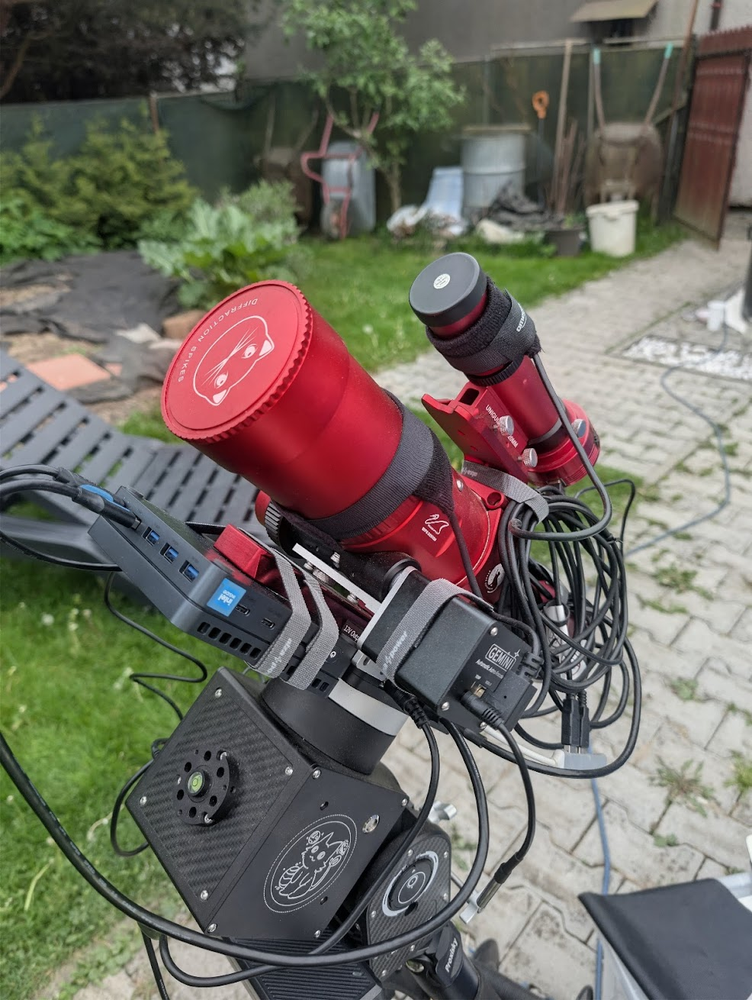
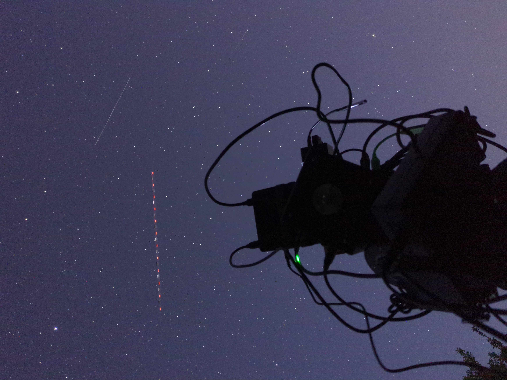

# Klasifikace astronomických fotografií

**Patrik Mintěl**

Semestrální Projekt - VŠB-TUO
Vedoucí práce: Ing. Jan Gaura, Ph.D.

---

# Motivace a pořizovací technika

- Problém: snímání objektů hlubokého vesmíru vyžaduje dlouhé expozice a stovky až tisíce snímků
- Surová data: data z kamer jsou uložena bez komprese či úprav
- Šum: užitečná data jsou skryta hluboko v šumu
- Lidský faktor: manuální kontrola snímků a vyřazování těch znehodnocených mraky, vadou, je časově náročné a chybové

---

    
    

<sopan style="text-align: center;">
ZWO ASI 585MC Pro - 4k Sony IMX585 CMOS senzor

---

# Datový formát FITS

---

# Tech stack

- Tauri
  - Framework kombinující Rust + Webové technologie
  - Výhody: rychlost (Rust) + jednoduché UI (HTML/CSS/JS)

- Rust
- Svelte (frontend)

---

---

# Import dat

- Podpora pro FITS formát
- Soubory jsou rozděleny podle absolutní cesty pomocí pravidel
- Prefix + Suffix
- /drive/Object M45/Session 2026-01-15/Light/....fits

---

# Seskupení dat

---

# Typy snímků

- Light: hlavní snímek s objektem
- Dark: snímek bez světla, zachycuje šum senzoru (musí sedět teplota, gain, expozice)
- Flat: snímek s rovnoměrným osvětlením, zachyzuje vinětaci a prach (musí být pořízena ideálně před/po noci)
- Bias: snímek s "nulovou" expozicí, zachycuje čtecí šum senzoru (musí gain)

- Master snímek: průměr z více snímků stejného typu
  - Tvořen skládáním (stackováním) jednotlivých snímků

---

# Kalibrace světelných snímků

- Tvorba master snímků pro Dark, Flat a Bias
- Master Dark: Sigma Clipped Mean (Welfordův algoritmus)
- Master Flat + Master Bias: průměr

- Kalibrační rovnice pro každý pixel:

$$ Calibrated = \frac{Light - MasterDark}{MasterFlat} $$

---

# Metriky

- Knihovna SEP - Source Extraction and Photometry
- Metriky pro každý snímek:

---

# Ověření a výsledky

- Dataset: Mlhovina Rozeta, celkem 1104 snímků + kalibrační data
- Výsledný čas zpracování 32 minut
  - 30 minut - kalibrace
  - 2 minuty - metriky
- Většinu času CPU spalo, čekalo na I/O operace (bottleneck)
- Paralelizace pomocí Rayon (Rust)
- každá operace: načíst obrázek -> zpracovat -> uložit

---

# Analyza výsledků

- Perfektně: kompletní mraky, rozmazání hvězd, nebo snímky bez hvězd
- Špatně: tenký mrak
  

---

# Závěr

- V nadměrném množství korektně klasifikuje snímek
- Nevýhoda: nutnost úpravy konstant pro klasifikaci podle dat
- Řešení: CNN pro klasifikaci snímků, bez nutnosti nastavovat konstanty
- Bude rozvinuto v rámci Diplomové práce
- Aktuální aplikace bude použita pro klasifikaci snímků pro vlastní NN dataset

---

